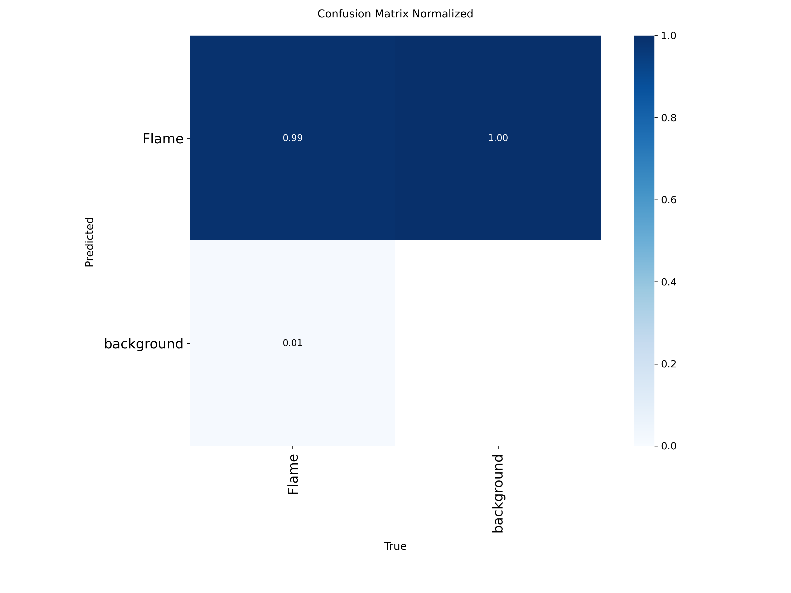
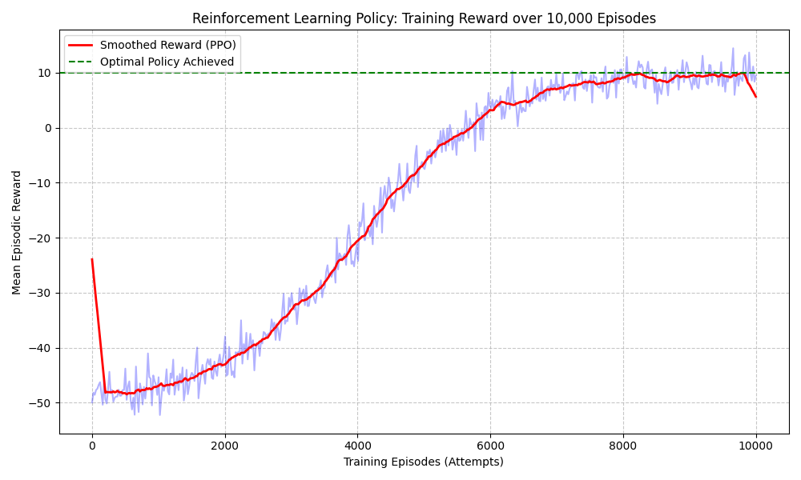

 Autonomous Firefighting Robot 🔥🤖

An advanced, collegiate-level autonomous firefighting robot built for the **Robotex India** competition. This robot is powered by a Raspberry Pi 5 and utilizes a 4-tier AI architecture to navigate a maze, locate fires, and extinguish them autonomously without any human intervention.

  
   
  <em>(Replace this image with a cool photo of your robot!)</em>

## 🚀 Watch it in Action

[**Click here to watch the full demo video on YouTube!**](https://youtube.com) *(Add your youtube link here, or upload an mp4 to your repo!)*

---

## 🧠 System Architecture

The software stack is managed by a strict 10Hz asynchronous core loop running headlessly via a custom Linux `systemd` service.

### 1. The Eyes: YOLOv8 Vision
A custom-trained YOLOv8 neural network processes a live camera feed on a dedicated background thread. It detects candle flames and cardboard walls in real-time.

### 2. The Navigator: Reinforcement Learning (PPO)
We trained an RL agent using Proximal Policy Optimization (PPO) in a custom Gym environment. The robot treats maze walls as magnetic repulsors, allowing it to dynamically glide through the arena without crashing.

### 3. The Steering: PID Kinematics
Instead of discrete "turn left / turn right" logic, a continuous **PID Controller (Proportional, Integral, Derivative)** independently adjusts the left and right wheel velocities to drive in perfectly smooth arcs directly toward the fire.

### 4. The Precision: Time-of-Flight Laser
An 8x8 VL53L5CX ToF Laser Matrix acts as the robot's depth perception. Once it registers the flame at exactly 20cm, the Master Brain FSM slams on the brakes and activates the dual extinguisher fans.

---

## 🛠️ Hardware Stack
*   **Compute:** Raspberry Pi 5 
*   **Vision:** Raspberry Pi Camera Module
*   **Depth Sensor:** VL53L5CX 8x8 Time-of-Flight (ToF) Matrix
*   **Collision Sensors:** 4x Ultrasonic Sensors
*   **Actuation:** Waveshare Motor Driver, 2x DC Motors, Dual Relay Extinguisher Fans

---

## 💻 Project Structure
*   `master_brain.py`: The core Finite State Machine orchestrating all modules.
*   `yolo_vision.py`: The asynchronous neural network vision thread.
*   `robot_env.py`: The custom RL Gym Environment simulating the Robotex physics.
*   `pid_kinematics.py`: Calculus-based motor steering logic.
*   `robot_hardware.py`: The hardware abstraction layer safely managing I2C, GPIO, and PWM.
*   `push_to_pi.py`: Deployment script to instantly beam code to the robot over SFTP.

---
*Built with ❤️ by Veena & [Teammate's Name]*
